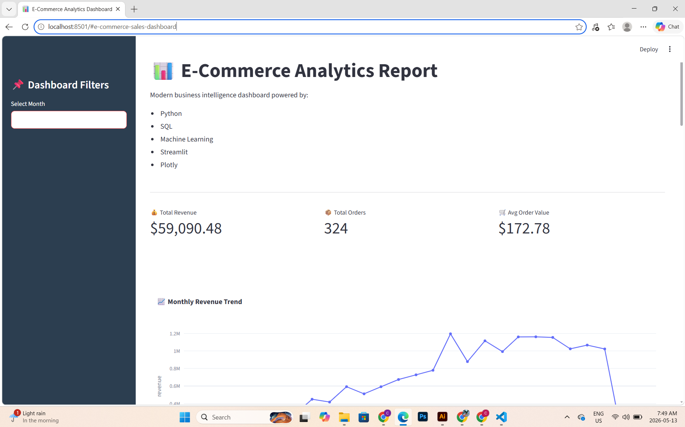
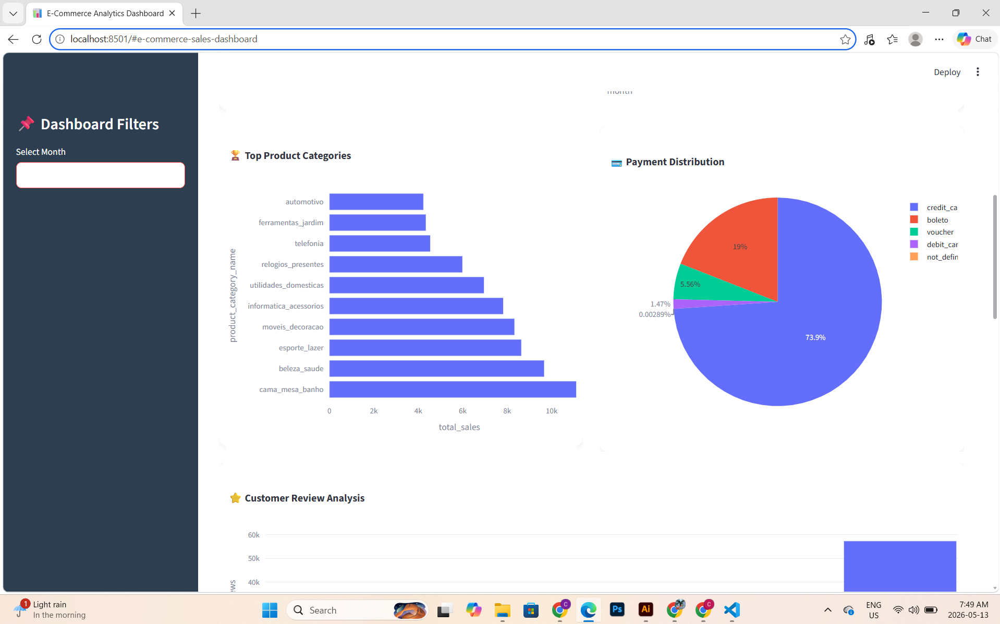
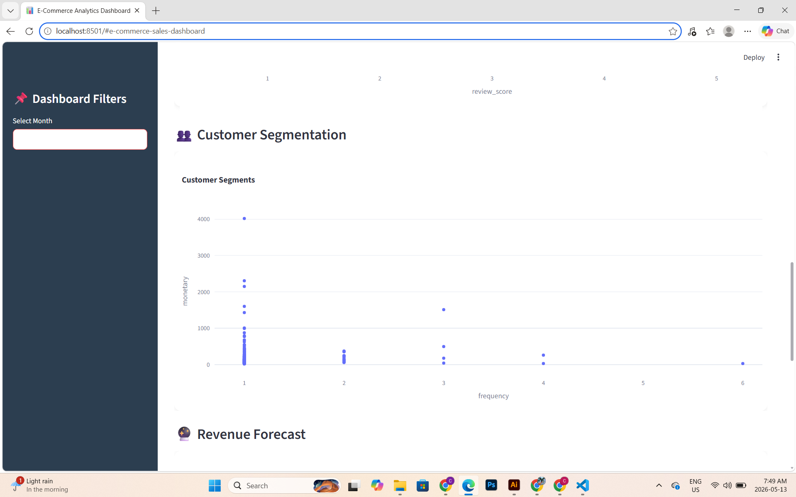

# 📊 E-Commerce Sales Dashboard

An end-to-end Data Analytics and Machine Learning project built using Python, SQL, Streamlit, and Plotly.

---

# 🚀 Live Dashboard

[Open Live Dashboard](https://ecommerce-sales-dashboard-gvntwif8niowah9w6b8glk.streamlit.app/)

---

# 📌 Project Overview

This project analyzes real-world Brazilian e-commerce sales data to uncover valuable business insights, customer behavior patterns, and future revenue trends.

The dashboard provides:
- Interactive KPI monitoring
- Revenue trend analysis
- Customer segmentation
- Sales forecasting
- Business insights visualization

The project was designed to simulate a real business intelligence workflow used in modern e-commerce companies.

---

# 🛠️ Technologies Used

| Technology | Purpose |
|---|---|
| Python | Data Analysis & Backend |
| Pandas | Data Cleaning & Analysis |
| SQLite | Database Management |
| SQL | Querying & KPI Analysis |
| Scikit-Learn | Machine Learning |
| Streamlit | Interactive Dashboard |
| Plotly | Interactive Visualizations |
| Matplotlib | Data Visualization |
| Seaborn | Exploratory Data Analysis |

---

# 📈 Key Features

## 📌 KPI Dashboard
- Total Revenue
- Total Orders
- Average Order Value (AOV)

## 📊 Visual Analytics
- Monthly Revenue Trends
- Top Product Categories
- Payment Method Distribution
- Customer Review Analysis

## 🤖 Machine Learning
- Customer Segmentation
- Revenue Forecasting
- Trend Prediction

## 🎛️ Interactive Dashboard
- Sidebar Filters
- Dynamic Charts
- Business Insights Section
- Responsive Layout

---

# 📷 Dashboard Preview

## Main Dashboard



---

## Revenue Forecast



---

## Customer Segmentation



---

# 📂 Project Structure

```text
ecommerce-sales-dashboard/
│
├── app/
│   └── dashboard.py
│
├── data/
│   └── ecommerce.db
│
├── notebooks/
│
├── models/
│
├── screenshots/
│   ├── Dashboard.png
│   ├── Forecast.png
│   └── Segmentation.png
│
├── requirements.txt
│
├── README.md
│
└── .gitignore
```

---

# ⚙️ Installation & Setup

## 1️⃣ Clone Repository

```bash
git clone https://github.com/Cghetiya/ecommerce-sales-dashboard.git
```

---

## 2️⃣ Navigate to Project

```bash
cd ecommerce-sales-dashboard
```

---

## 3️⃣ Install Dependencies

```bash
pip install -r requirements.txt
```

---

## 4️⃣ Run Dashboard

```bash
streamlit run app/dashboard.py
```

---

# 📊 Business Insights

- Revenue demonstrates consistent growth over time.
- Credit cards are the dominant payment method.
- Certain product categories significantly outperform others.
- Customer satisfaction is generally high based on review scores.
- Forecasting suggests continued business expansion.

---

# 🔮 Future Improvements

- Advanced forecasting models
- Real-time data integration
- Cloud database deployment
- User authentication system
- Enhanced dashboard UI/UX

---

# 👨‍💻 Author

Charmi Ghetiya

---

# ⭐ If You Like This Project

Please consider giving this repository a star ⭐
